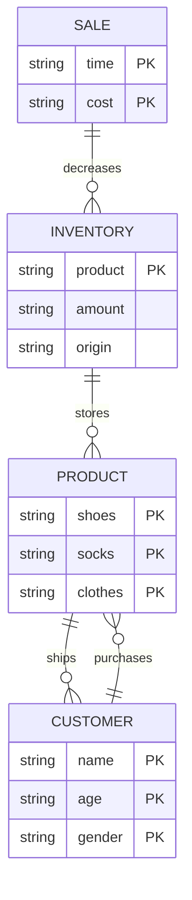

#### Descriptions
* Product – the product ships to and ends up in the possession of the customer. The type of product is important for sales information.
* Customer – the customer purchases the product. The demographic of the customers and what products they are purchasing is important.
* Sale – The sale decreases inventory and increases profit. Information about each sale such as the time and total cost is important.
* Inventory – The store inventory stores all available product. Information about the inventory such as the products, amount of product, and origin of the products is important.
